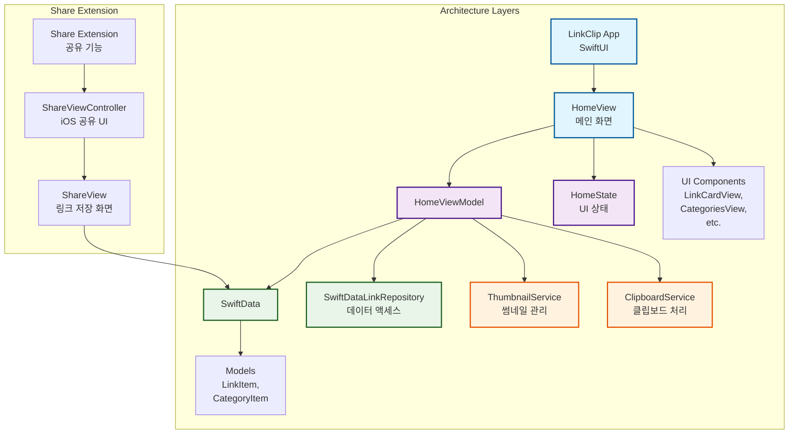

# LinkClip

### 가장 심플한 링크 저장소 LinkClip


<a href="https://apps.apple.com/kr/app/linkclip-%EC%86%90%EC%89%AC%EC%9A%B4-%EB%A7%81%ED%81%AC-%EC%A0%80%EC%9E%A5/id6744954526">
 
</div>

## 목차
- [🚀 개발 기간](#-개발-기간)
- [💻 개발 환경](#-개발-환경)
- [👀 미리 보기](#-미리-보기)
- [📐 아키텍처 요약](#-아키텍처-요약)
- [📝개발 내용](#-개발-내용)
- [📁 파일 구조](#-파일-구조)

---

# 🚀 개발 기간
25.02.18 ~ 25.04.23 (약 2개월)

25.06.04 ~ ing (추가기능 및 로컬라이징) - Spotlight 검색 기능 추가 완료(2025.10.28)

~ 25.12.21 전반적인 디자인 수정 및 썸네일 표시 기능 추가

# 💻 개발 환경
- `XCode 16.3`
- `Swift 6.0.0`


# 👀 미리 보기
<div>
 
 
</div>

# 📐 아키텍처 요약



# 📝 개발 내용

### 앱의 방향성

- 앱의 방향성에 대해서 개발을 진행하기 전 생각했던 점들을 정리할까 합니다.
먼저, URL 저장소의 필요성을 느낀건 개발 공부나 여러가지 글을 읽다보면 나중에 찾아볼 때가 생깁니다. 그래서 유용하게 사용하던 것이 카카오톡의 ‘나에게 보내기’ 기능이었습니다. 하지만 나에게 보내기 기능은 정렬기능과 카테고리 기능이 없어 저장해놓은 링크에 대한 정보를 찾기 쉽지 않았습니다.
- 왜 ShareExtension인가?
일반적으로 링크를 저장하는 방법은 copy & paste 방식으로 해당 URL을 직접 복사하여 저장하는 방식이었습니다. 하지만 ShareExtension을 사용하면 사용자가 직접적으로 URL을 복사하지 않고 앱으로 데이터를 보낼 수 있으며 추가적으로 해당 URL에 대한 정보나 개인 메모 등을 입력할 수 있었습니다.

### 심플한 디자인

- ~~앱의 UI를 설계할 때 가장 먼저 고민해야하는 것은 사용자가 불편함을 느끼지 않냐 입니다. 추후에 앱에 기능을 추가할 때 기존 인터페이스를 유지할 수 있도록 TabView를 사용하여 사용자에게 여러 기능을 제공할 수 있게 설계하였습니다.~~
- ~~온보딩 화면을 넣자!~~
~~앱을 처음 설치한 사용자는 사용법을 모르기 때문에 앱에 대한 간략한 설명을 제공해야 합니다. 현재는 아이콘과 텍스트로만 온보딩을 구성하였지만 추후에 gif나 영상을 통해 더욱 직관적으로 온보딩을 수정할 예정입니다.~~
- 온보딩 화면을 따로 표시하는 것도 좋지만, 앱을 처음 실행했을 때 사용자가 처음 맞닥뜨리는 화면이 중요하다고 생각하여 온보딩의 내용을 카드형식으로 구성하였습니다.
- 추가로 사용자가 여러 개의 링크를 관리할 수 있도록 플로팅 버튼을 만들어 다중 선택을 가능하게 하였습니다.
  - 다중 선택된 링크를 공유하면 Text형식으로 저장된 링크의 제목과 url이 공유됩니다.

<details>
 <summary>이전 디자인</summary>
<div>
 
 
 
</div>
</details>

<div>
 
 
</div>

# 📁 파일 구조
```
.
├── App
│   ├── LinkClip.entitlements
│   └── LinkClip.swift
├── Core
│   ├── Components
│   │   ├── CachedAsyncImageView.swift
│   │   ├── CategoriesView.swift
│   │   ├── CategoryChip.swift
│   │   ├── Color+Extension.swift
│   │   ├── ColorPaletteView.swift
│   │   ├── LinkCardView.swift
│   │   ├── LinkRowView.swift
│   │   ├── Localizable.xcstrings
│   │   ├── String+Extension.swift
│   │   ├── TagCapsuleView.swift
│   │   └── ToastModifier.swift
│   ├── Models
│   │   ├── LinkItem.swift
│   │   ├── SearchScope.swift
│   │   ├── ShareError.swift
│   │   └── SortOption.swift
│   └── Services
│       ├── ClipboardService.swift
│       ├── Repository
│       │   ├── LinkRepository.swift
│       │   └── SwiftDataLinkRepository.swift
│       ├── SpotlightIndexingService.swift
│       ├── SwiftDataContainer.swift
│       ├── SystemClipboardService.swift
│       ├── SystemURLOpener.swift
│       ├── ThumbnailService.swift
│       └── URLOpener.swift
├── Disabled
│   └── MainView
│       ├── OldView
│       │   ├── OldCategoryView.swift
│       │   ├── OldEditView.swift
│       │   ├── OldHomeView.swift
│       │   ├── OldLinkRowView.swift
│       │   ├── OldMainView.swift
│       │   ├── OldNothingView.swift
│       │   └── OnboardingView.swift
│       └── OldViewModel
│           └── OldMainViewModel.swift
├── Features
│   ├── Category
│   │   └── View
│   │       ├── AddCategoryView.swift
│   │       ├── CategoryEditView.swift
│   │       └── CategoryManagementView.swift
│   ├── Home
│   │   ├── View
│   │   │   ├── AddLinkView.swift
│   │   │   ├── HomeEditToolbarView.swift
│   │   │   ├── HomeHeaderView.swift
│   │   │   ├── HomeLinksView.swift
│   │   │   ├── HomeSheetManager.swift
│   │   │   ├── HomeState.swift
│   │   │   └── HomeView.swift
│   │   └── ViewModel
│   │       └── HomeViewModel.swift
│   ├── Settings
│   │   └── View
│   │       ├── MailView.swift
│   │       └── SettingView.swift
│   └── Share
│       └── View
│           └── ShareView.swift
├── Preview
│   └── Preview Content
│       ├── Preview Assets.xcassets
│       │   └── Contents.json
│       └── SampleData.swift
└── Resources
    └── Assets.xcassets
        ├── AccentColor.colorset
        │   └── Contents.json
        ├── AppIcon.appiconset
        │   ├── 1024.png
        │   ├── 114.png
        │   ├── 120 1.png
        │   ├── 120.png
        │   ├── 180.png
        │   ├── 40.png
        │   ├── 58.png
        │   ├── 60.png
        │   ├── 80.png
        │   ├── 87.png
        │   └── Contents.json
        ├── BackgroundColor.colorset
        │   └── Contents.json
        ├── Contents.json
        ├── MainColor.colorset
        │   └── Contents.json
        └── SettingImage.imageset
            ├── 58.png
            └── Contents.json

31 directories, 67 files
```
